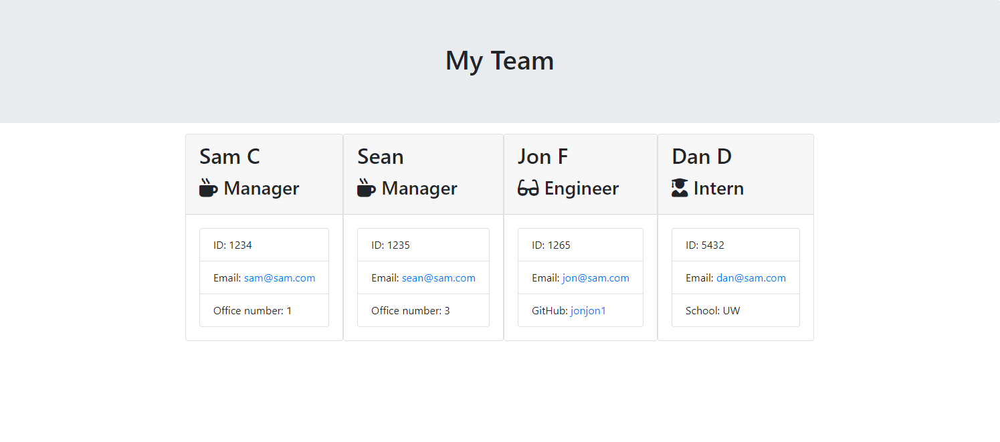

# Template-Engine

## Contents 

1. [ Introduction ](#intro)
2. [ Installation ](#install)
3. [ Usage ](#usage)
4. [ Tests ](#tests)
5. [ Contact Information ](#questions)

 

## 1. Introduction

>Using Inquirer to prompt the user to create employee profiles that will generate a html document with user information displayed.

### 2. Installation

>Install Inquirer and Jest NPM

### 3. Usage

>Follow prompts to create employee profiles

>Video Demo - https://drive.google.com/file/d/1yc5XI2X12F0UEiUZz6zaWmYotyJtiQVT/view 

#### Example Browser Page from Video Demo

### 4. Tests

>functionality testing can be found the the `test` folder.

### 5. Contact Information

GitHub: https://github.com/sclitty
